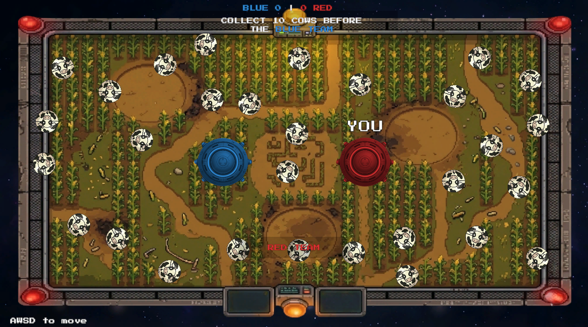
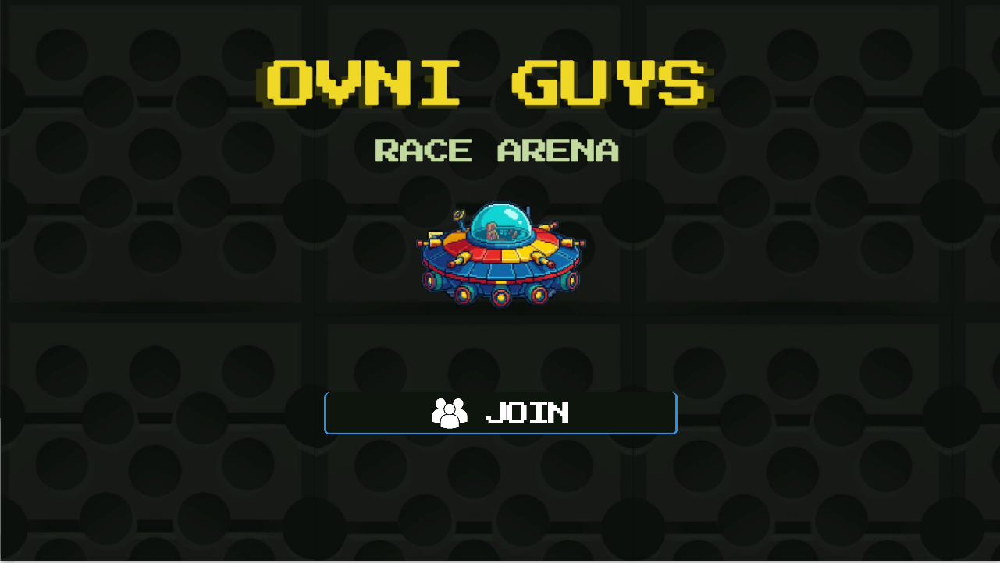
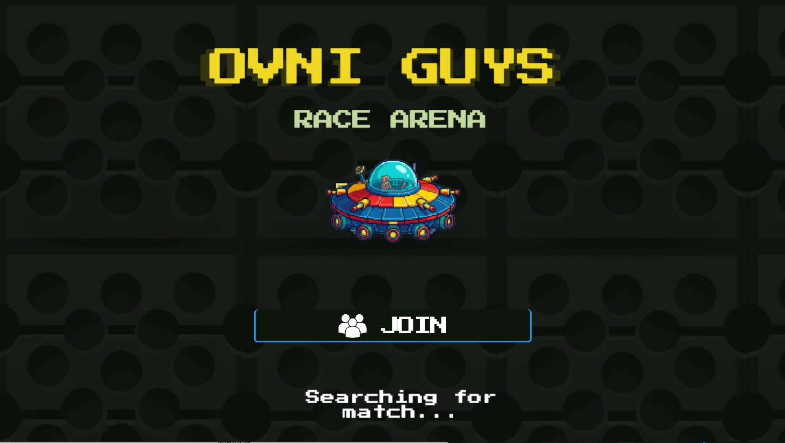
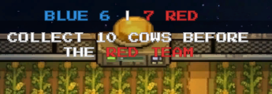
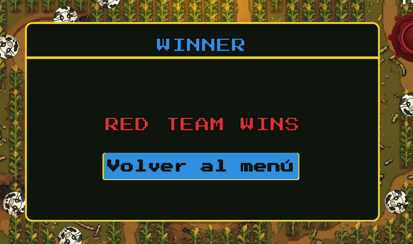

<a name="readme-top"></a>

[](https://unity.com/)
[](https://learn.microsoft.com/en-us/dotnet/csharp/)
[](https://dotnet.microsoft.com/)
[](https://www.microsoft.com/windows)
[](https://learn.microsoft.com/en-us/dotnet/api/system.net.http)
[](https://docs.unity3d.com/Manual/com.unity.textmeshpro.html)
[](.)

<br />

# Ovni Guys Race Arena — Juego Multijugador en Red

Juego de recoleccion en tiempo real para 2 jugadores, desarrollado en Unity con comunicacion **HTTP REST** sobre el servidor de clase. Cada jugador controla un OVNI y compite por recolectar 10 vacas antes que el oponente. No hay servidor dedicado propio; toda la sincronizacion pasa por el servidor HTTP proporcionado en clase.

---

## Tabla de Contenidos

- [Descripcion General](#descripcion-general)
- [Requisitos Tecnicos](#requisitos-tecnicos)
- [Como Ejecutar el Juego](#como-ejecutar-el-juego)
- [Comunicacion Cliente-Servidor](#comunicacion-cliente-servidor)
- [Sincronizacion y Suavizado](#sincronizacion-y-suavizado)
- [Flujo Completo del Juego](#flujo-completo-del-juego)
- [Estructura de Scripts](#estructura-de-scripts)
- [Limitaciones Conocidas](#limitaciones-conocidas)

---

## Descripcion General

**Ovni Guys Race Arena** es un juego de competencia para exactamente 2 jugadores. El Equipo Azul (`Player 0`) y el Equipo Rojo (`Player 1`) se conectan desde instancias independientes del ejecutable. Una vez que ambos estan listos, el juego lanza una cuenta regresiva sincronizada y comienza la partida.

Durante la partida, vacas (orbs) aparecen de forma escalonada en posiciones generadas con semilla fija, garantizando el mismo mapa para los dos clientes. Cada jugador ve al oponente moviendose en tiempo real. El primero en recolectar 10 vacas gana; la pantalla de resultado se muestra de forma simultanea en ambos clientes.



---

## Requisitos Tecnicos

| Requisito | Detalle |
|---|---|
| Motor | Unity 2022.3 LTS |
| Lenguaje | C# (.NET Standard 2.1) |
| Protocolo de red | HTTP REST (`UnityWebRequest`) |
| Servidor | `http://localhost:5005/server` (proporcionado en clase) |
| Jugadores simultaneos | Exactamente 2 |
| Frecuencia de sincronizacion | 50 Hz (`syncInterval = 0.02 s`) |
| Target frame rate | 60 FPS |
| TextMeshPro | Requerido (disponible en Unity Package Manager) |
| Plataforma | Windows 10 / 11 |

> Ambas instancias deben poder alcanzar el servidor en `localhost:5005`. Para jugar en red local, la URL se configura en el componente `ApiClient` (`baseUrl`).

---

## Como Ejecutar el Juego

### Paso 1 — Iniciar el servidor

Asegurarse de que el servidor de clase este corriendo en `http://localhost:5005` antes de abrir el juego.

### Paso 2 — Lanzar dos instancias

Compilar el proyecto desde Unity (`File > Build & Run`) y ejecutar dos copias del binario. Tambien es posible usar una instancia en el editor y otra como build.



### Paso 3 — Buscar partida

En cada instancia, presionar **"Find Match"**. El sistema de matchmaking asigna automaticamente `Player 0` a la primera instancia que se registra y `Player 1` a la segunda.



### Paso 4 — Jugar

Una vez que ambos jugadores estan conectados, `Player 0` envia la senal de inicio. Ambas instancias muestran una cuenta regresiva de 3 segundos y habilitan el movimiento al llegar a **GO**.

### Controles en partida

| Accion | Control |
|---|---|
| Mover el OVNI | `W A S D` / Flechas del teclado |

---

## Comunicacion Cliente-Servidor

El juego usa exclusivamente el servidor HTTP entregado en clase. Toda la sincronizacion ocurre mediante peticiones `GET` y `POST` a dos endpoints.

### Endpoints

| Metodo | URL | Descripcion |
|---|---|---|
| `POST` | `http://localhost:5005/server/{gameId}/{playerId}` | Envia posicion y evento del jugador local |
| `GET` | `http://localhost:5005/server/{gameId}/{playerId}` | Recibe el ultimo estado del oponente |

### Estructura del mensaje (`ServerData`)

```json
{
  "posX": 1.5,
  "posY": -0.8,
  "posZ": 0.0
}
```

Los campos `posX` y `posY` transportan la posicion del jugador en el plano 2D. El campo `posZ` actua como canal de eventos y no representa coordenada espacial.

### Codificacion de eventos en `posZ`

| Valor de `posZ` | Significado |
|---|---|
| `0` | Sin evento activo |
| `>= 1000` y `< 9000` | El jugador recolecto la vaca con `id = posZ - 1000` |
| `>= 9000` | El jugador gano la partida; ultima vaca con `id = posZ - 9000` |
| `posY == 1000` (matchmaking) | Jugador registrado y listo para iniciar |

Este esquema permite comunicar eventos de juego sin agregar endpoints adicionales al servidor.

### Flujo de un tick de sincronizacion

```
Cada 20 ms (GameManagerHTTP.Tick):
  1. Lee la posicion del transform del jugador local
  2. POST  envia posicion + posZ al servidor
  3. GET   recibe la ultima posicion del oponente
  4. Interpola la posicion recibida con SmoothDamp
  5. Evalua posZ del oponente: orb recolectado o fin de partida
```

Las peticiones se lanzan como corutinas de Unity (`UnityWebRequest`) desde `ApiClient`, de modo que el hilo principal nunca se bloquea mientras espera la respuesta del servidor.

---

## Sincronizacion y Suavizado

### Interpolacion de posicion — `PlayerMovementInterpolator`

El jugador remoto no se teletransporta entre actualizaciones de red. La posicion recibida se usa como objetivo y la posicion visual se calcula con `Vector3.SmoothDamp`:

- `smoothTime = 0.025 s` — ajustado para compensar el intervalo de polling de 20 ms.
- El primer dato recibido se aplica directamente para evitar que el jugador remoto aparezca en el origen.
- La velocidad de interpolacion se acumula frame a frame por ID de jugador, produciendo movimiento continuo y sin saltos.

### Sistema de polling no bloqueante

`HttpNetworkService` delega cada peticion a una corutina iniciada por `GameBootstrap` (que actua como `MonoBehaviour` runner). Esto garantiza que el polling no congela el juego aunque el servidor tarde en responder.

### Frecuencia y carga de red

Con `syncInterval = 0.02 s` el cliente realiza 50 pares de peticiones por segundo (50 POST + 50 GET). El servidor recibe en total 100 peticiones por segundo con dos jugadores conectados.

---

## Flujo Completo del Juego

```
[Menu Principal]
      |
      v
[Matchmaking]
  - Jugador se registra: posY = 1000, posX = playerId
  - Hace polling hasta detectar al oponente con posY == 1000
  - Player 0 envia posZ = 3.0 (senal de inicio con countdown de 3 s)
  - Ambos esperan el delay y cargan la escena Game
      |
      v
[Cuenta regresiva 3-2-1-GO]
  - El input del jugador local permanece deshabilitado
  - Al llegar a GO, PlayerLocalController se activa
      |
      v
[Partida en curso]
  - Orbs aparecen escalonados (30 orbs en 20 s, cada ~0.67 s)
  - Polling activo cada 20 ms
  - Marcador actualizado en tiempo real para ambos jugadores
      |
      v
[Fin de partida]
  - Un jugador alcanza 10 orbs y envia posZ >= 9000
  - Ambos clientes muestran WINNER / LOSER segun corresponda
  - Time.timeScale = 0 (juego pausado)
  - Boton de salida regresa al menu principal
```





**Condiciones especiales:**
- Si un jugador se desconecta antes del fin de partida, el oponente permanece en pantalla sin actualizacion. No hay deteccion de timeout.
- Si el servidor no esta disponible al iniciar el matchmaking, las peticiones fallan silenciosamente y el polling continua intentando.

---

## Estructura de Scripts

```
Scripts/
|
+-- Core/
|   +-- GameBootstrap              # Punto de entrada: construye e inyecta todas las dependencias
|   +-- GameManagerHTTP            # Loop principal: gestiona el tick de sincronizacion (50 Hz)
|
+-- Gameplay/
|   +-- GameState/
|   |   +-- IGameStateService          # Interfaz del estado de juego
|   |   +-- DefaultGameStateService    # Construye ServerData y procesa eventos remotos
|   |   +-- EventProcessor             # Decodifica eventos del canal posZ
|   |
|   +-- Orbs/
|   |   +-- Orb                        # Rotacion visual del orb en el eje Z
|   |   +-- OrbCollector               # Deteccion de colision local y logica de puntaje
|   |   +-- OrbId                      # Identificador unico asignado a cada orb
|   |   +-- OrbManager                 # Generacion determinista y spawn escalonado
|   |
|   +-- Player/
|       +-- IPlayerSyncService         # Interfaz de sincronizacion de jugadores
|       +-- DefaultPlayerSyncService   # Spawn e interpolacion del jugador remoto
|       +-- PlayerLabel                # Etiqueta YOU flotante sobre el jugador local
|       +-- PlayerLocalController      # Input WASD/flechas y clamp de posicion en arena
|       +-- PlayerManager              # Instancia los prefabs de jugador segun ID
|       +-- PlayerMovementInterpolator # SmoothDamp para suavizar el movimiento remoto
|       +-- PlayerSpawner              # Utilidad de spawn por ID con soporte a PlayerTag
|       +-- PlayerSyncController       # Controlador alternativo de sync (no activo en main)
|       +-- PlayerTag                  # Componente de identificacion de jugador por ID
|
+-- Matchmaking/
|   +-- FileLock                   # Libera el lock de archivo al cerrar la aplicacion
|   +-- Matchmaking                # Logica de busqueda de partida y senal de inicio
|   +-- PlayerIdAssigner           # Asigna Player 0 o Player 1 mediante file locks del SO
|
+-- Networking/
|   +-- ApiClient                  # Corutinas HTTP: GET y POST con UnityWebRequest
|   +-- HttpNetworkService         # Adaptador INetworkService hacia ApiClient
|   +-- INetworkService            # Interfaz de red (Send / Receive)
|   +-- ServerData                 # DTO serializable: posX, posY, posZ
|
+-- Systems/
|   +-- SceneLoader                # Carga la escena Game por nombre
|   +-- ScoreUI                    # Marcador BLUE vs RED con TextMeshPro
|   +-- SpawnManager               # Devuelve la posicion de spawn segun ID del jugador
|   +-- UnityMainThreadDispatcher  # Cola thread-safe de acciones para el hilo principal
|
+-- UI/
    +-- ExitButtonUI               # Limpia el matchmaking y vuelve al menu principal
    +-- GameEndUIController        # Muestra WINNER/LOSER y congela Time.timeScale
    +-- GameStartCountdown         # Cuenta regresiva y habilitacion del input local
```

### Patrones de diseno aplicados

**Inyeccion de dependencias.** `GameBootstrap` instancia `HttpNetworkService`, `DefaultGameStateService` y `DefaultPlayerSyncService`, y los pasa a `GameManagerHTTP.Init()`. El manager no conoce la implementacion concreta que recibe.

**Segregacion de interfaces.** `INetworkService`, `IGameStateService` e `IPlayerSyncService` permiten sustituir cualquier capa sin modificar el nucleo del juego.

**Codificacion de eventos en canal existente.** Los eventos de juego viajan codificados en `posZ` dentro del mismo `ServerData` que transporta la posicion. No se requieren endpoints adicionales ni mensajes separados.

---

## Limitaciones Conocidas

| Problema | Descripcion |
|---|---|
| **Servidor local unico** | El servidor debe estar en `localhost:5005`. Para jugar en red real se debe cambiar `baseUrl` en `ApiClient` antes de compilar. |
| **Sin deteccion de desconexion** | Si un jugador cierra el juego a mitad de partida, el oponente no recibe notificacion. La partida queda congelada para quien sigue en linea. |
| **Matchmaking en misma maquina** | `PlayerIdAssigner` usa file locks del sistema operativo para distinguir instancias. Funciona correctamente solo cuando ambas instancias corren en el mismo equipo. |
| **Sin reconexion** | No hay logica de reintento si un cliente pierde conexion en mitad de partida. |
| **Sincronizacion de orbs por eventos** | El estado de los orbs se deduce a partir de los eventos en `posZ`. Si un cliente se reinicia, puede mostrar orbs que ya fueron recolectados. |
| **gameId fijo** | El identificador de partida esta hardcodeado como `"game1"`. No es posible tener sesiones paralelas entre pares distintos de jugadores en el mismo servidor. |
| **Dos jugadores exactos** | El sistema no contempla menos ni mas de 2 jugadores. No hay soporte para espectadores ni reconexion de un tercer cliente. |
| **Carga de red fija** | Con dos clientes activos el servidor recibe ~100 peticiones por segundo. En redes con latencia alta el suavizado compensa parcialmente, pero pueden aparecer desfases visibles. |

<p align="right"><a href="#readme-top">Volver al inicio</a></p>